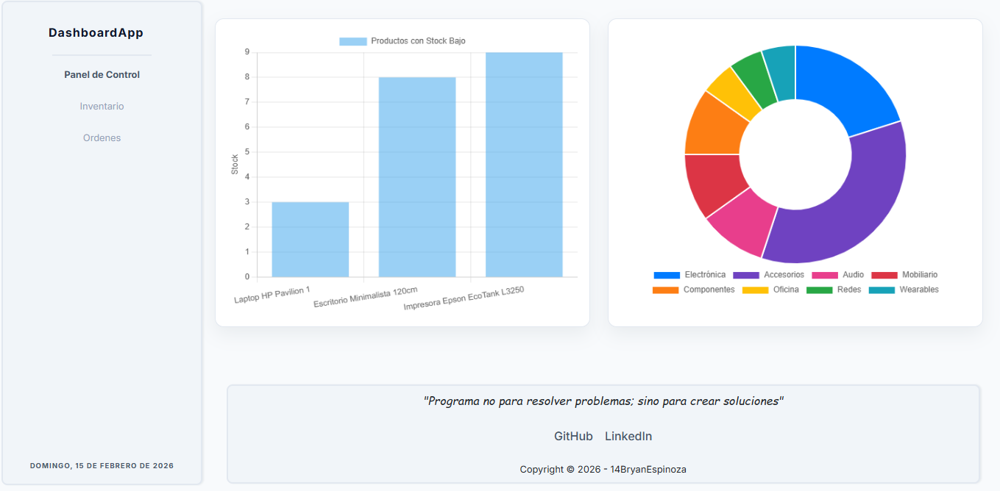

# DashboardApp

Dashboard administrativo para visualización de datos con gráficas interactivas. Proyecto de práctica enfocado en Bootstrap y Sass.

## 🛠️ Tecnologías

- HTML5
- CSS3 / Sass
- JavaScript
- Bootstrap 5.3
- Chart.js
- pnpm

## 📋 Requisitos

- Node.js (v18 o superior)
- pnpm

## 🚀 Instalación y Comandos

```bash
# Instalar dependencias
pnpm install

# Compilar Sass
pnpm run build

# Compilar Sass en modo watch
pnpm run watch
```

## 📸 Captura

<!-- Agregar captura de pantalla aquí -->


## 🔗 Demo

[Ver sitio en vivo](https://dashboardapp14bz.netlify.app/)

## 📊 Estado del Proyecto

✅ En desarrollo activo

## 🔮 Mejoras Futuras

- [ ] Agregar más tipos de gráficas
- [ ] Implementar modo oscuro
- [ ] Añadir filtros de datos
- [ ] Exportar reportes en PDF
- [ ] Mejorar responsividad en dispositivos móviles

---

Desarrollado por [14BryanEspinoza](https://github.com/14BryanEspinoza)
