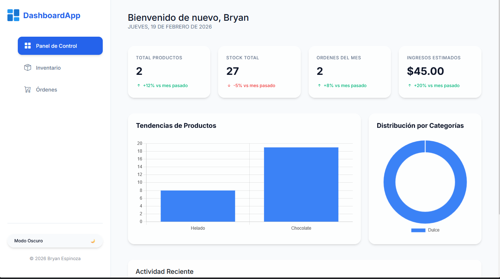

# DashboardApp - 14BryanEspinoza

## 📋 Descripción del Proyecto

Dashboard administrativo de alto rendimiento diseñado para la gestión eficiente de inventarios y órdenes.

- **Diseño Glassmorphism**: Interfaz moderna con efectos de cristal sutiles, sombras dinámicas y transiciones suaves.
- **Arquitectura Mobile-First**: Optimizado totalmente para dispositivos móviles con un Sidebar lateral colapsable e interactivo.
- **Gestión Reactiva**: KPIs dinámicos (Stock, Ingresos, Productos) que se actualizan en tiempo real mediante un sistema de eventos.
- **Modo Oscuro Nativo**: Soporte completo para temas Claro/Oscuro persistente mediante variables CSS (Tokens de diseño).
- **Módulos de Gestión**:
  - **Inventario**: Control total de productos, categorías y precios.
  - **Órdenes**: Sistema de ventas con validación automática de stock.
- **Visualización de Datos**: Gráficas interactivas con **Chart.js** sincronizadas con los datos de la aplicación.

## 🛠️ Stack Tecnológico

- **HTML5**: Semántica estricta y accesibilidad (A11y/ARIA).
- **CSS3 / Sass**: Arquitectura modular basada en `@use`, BEM estricto, Mixins reutilizables y Design Tokens.
- **JavaScript (ES6+)**: Lógica desacoplada, módulos de utilidad para `localStorage` y manejo defensivo de datos.
- **Bootstrap 5.3**: Utilidades de layout y componentes base optimizados.
- **Chart.js**: Visualización dinámica de tendencias y categorías.

## 🔧 Requisitos

- **Node.js**: v18 o superior.
- **Package Manager**: pnpm (recomendado) o npm.

## 🚀 Instalación y Desarrollo

```bash
# 1. Instalar dependencias
pnpm install

# 2. Compilar Sass en modo desarrollo (Watch)
pnpm run watch

# 3. Compilar para producción
pnpm run build
```

## 📸 Vista previa



## 🔗 Enlace del proyecto

- **Sitio en vivo**: [Ver Proyecto](https://dashboardapp14bz.netlify.app/)

---

## 📊 Estado del Proyecto

- [x] Diseño Glassmorphism
- [x] Arquitectura Mobile-First
- [x] Gestión Reactiva
- [x] Modo Oscuro Nativo
- [x] Módulos de Gestión
- [x] Visualización de Datos

**Próximos Pasos**:

- Implementar sistema de autenticación.
- Agregar soporte para múltiples idiomas.
- Integrar con base de datos remota.
- Implementar sistema de notificaciones.
- Agregar soporte para múltiples idiomas.
- Integrar con base de datos remota.

### Desarrollado por Bryan Espinoza - 2026
